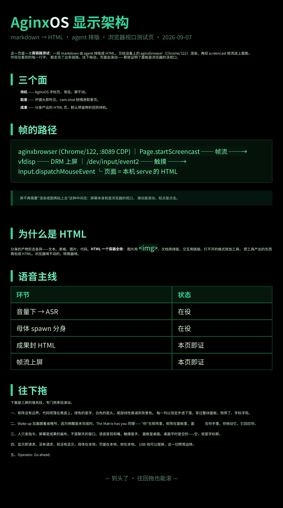
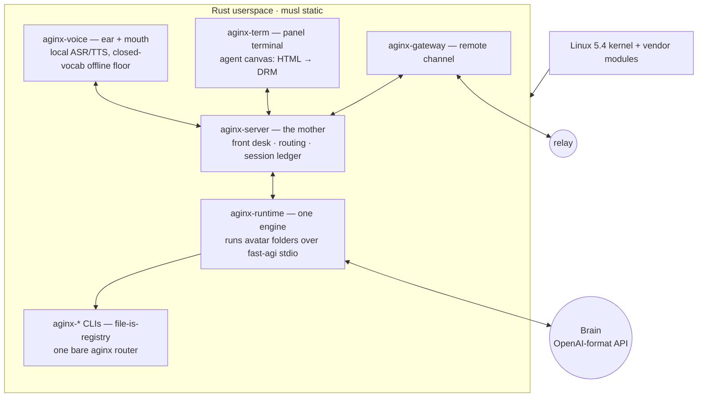

<div align="center">


# AginxOS

**An operating system for AI agents, written in Rust — running on a real phone.**

Linux kernel for drivers · Rust userspace for the system · one Pixel 5, no emulator

[](https://www.rust-lang.org)
[](https://musl.libc.org)
[](#the-metal)
[](./LICENSE)

给 Agent 的操作系统 —— 人只发指令，机器干活。

</div>

---

This repository is the **platform heart** of AginxOS: it owns the device and
the bake chain. The first-generation repo
([`aginxos`](https://github.com/yinnho/aginxos)) is frozen as the asset
library; the on-device HTML engine lives in
[`aginxbrowser`](https://github.com/yinnho/aginxbrowser); signed packages
mirror at [pkgs.aginx.net](https://pkgs.aginx.net).

## An OS whose primary user is an agent

AginxOS is built on one bet: the next personal device's main user is an AI
agent, and a human-tuned app stack just gets in its way. So the machine is
re-cut around the agent's body:

- **Mouth and ear come first.** Push-to-talk voice in, speech out. A closed
  local vocabulary works with zero network — the floor, not the ceiling; a
  cloud brain (any OpenAI-format API) does the rest.
- **The camera is a peer input.** Volume-up opens the eye: a resident
  viewfinder with a full software ISP feeding QR decode and OCR.
- **The screen is the agent's canvas, not a chat window.** UI is HTML; an
  on-device engine rasterizes it and blits straight to the DRM panel.
  Display is request semantics: pages, not apps.
- **One machine, one server.** The platform is a single web server — the
  mother (`aginx-server`): front desk, routing, session ledger. Avatars
  (agent personas) are folders under `~/.aginx/workspaces/`, run by one
  runtime engine over a stdio frame protocol — hot when busy, cold when not.
- **Everything external is a CLI.** Capabilities enter as `aginx-*`
  binaries registered by the filesystem itself; a single bare `aginx`
  router dispatches. Outbound is a CLI, inbound is a webhook — no in-process
  plugin ABI to fight.

AginxOS is _not_ an app or an agent framework — it is a full phone bring-up:
boot chain, DRM panel, camera pipeline, audio DSP, video codecs, A/B
updates, a supervisor, a signed package chain, and a terminal that runs on
the panel itself.

## Measured on the device, or it didn't happen

The project's law is **compile success ≠ bring-up success** — every claim
below carries a receipt from real hardware:

- 45-check device acceptance suite, green on first run after the flash
- Voice round-trip ~2 s end to end (down from 28 s): local ASR/TTS first,
  cloud brain fallback
- Resident viewfinder at ~14 fps with zero stalls — full-res demosaic +
  area downsample, AWB / CCM / tone, LC898129 autofocus servo: a software
  ISP tuned frame by frame against reference phones
- Hardware H.264 decode to zero-copy DRM planes with synced audio, and
  hardware H.264 encode on the same Venus block
- A/B slot updates through an ed25519-signed package chain — staged, atomic,
  self-recovering

## The metal

**Google Pixel 5** (`redfin`, Snapdragon 765G / SM7250), unlocked, one
dedicated experiment unit — no Android userspace, no emulator:

```text
XBL (fused, signed) → AginxOS bootloader → Linux 5.4 kernel + vendor modules → Rust userspace
```

- DRM/DSI panel driven directly — dumb-buffer modeset, page flips that wait
  on vblank; the boot card plays Matrix rain, then typewrites the wordmark
- imx363 raw (RDI) → software ISP; cs35l41 speaker DSP with firmware
  hand-off and calibration; Venus video codec; DMIC capture
- Remote channel: `aginx-gateway` registers home to a relay — the mother is
  reachable from anywhere as if local
- busybox and a thin C / Python tool tier ride along as assets; the system
  itself — supervisor, server, runtime, voice, terminal, packages, gateway —
  is Rust

## What it looks like

<table>
<tr>
<td></td>
<td></td>
<td></td>
</tr>
</table>

Left/middle: the boot card on the panel — rain while bring-up reports in,
wordmark when every stage is green. Right: a markdown brief the agent wrote,
rendered as HTML on the same panel.

## Architecture



## Crates

| Crate | Binary | Role |
|-------|--------|------|
| `crates/router` | `aginx` | the bare command — mother's face, file-is-registry dispatch |
| `crates/server` | `aginx-server` | front desk (进/住/切/退), session cursor, request routing, session ledger |
| `crates/runtime` | `aginx-runtime` | fast-agi engine: runs an avatar folder |
| `crates/agi` | — | fast-agi v0 frame types |
| `crates/agio` | — | D1 output envelope for every CLI |
| `crates/voice` | `aginx-voice` | voice dialog daemon — PTT input, closed-vocab protocol, face writer |
| `crates/wizard` | `aginx-net-wizard` | first-boot Wi-Fi setup TUI |
| `crates/term` | `aginx-term` | on-device terminal UI (launcher + pty shell on the panel) |
| `crates/pkg` | `aginx-pkg` | package manager — signed manifest, 四件套 tars |
| `crates/svc` | `aginx-svcd`/`aginx-svc`/`aginx-boot-ok` | supervisor, control client, A/B slot marker |
| `crates/sign` | `aginx-sign` | host-side ed25519 signer/verifier |
| `crates/qr` | `aginx-qr` | QR decode CLI — quircs + jpeg decode face (built in its own zigbuild pass) |
| `crates/img` | `aginx-img` | vendored libjpeg-turbo decode (shared FFI) |
| `crates/download` | `aginx-download` | HTTPS downloader — streaming, .part+rename |
| `crates/update` | `aginx-update` | signed A/B rootfs updater — swap + state tar |
| `crates/done` | `aginx-done` | provision done markers |
| `crates/secret` | `aginx-secretd`/`aginx-secret` | secret sidecar daemon + admin face |
| `crates/gateway` | `aginx-gateway` | remote channel — registers to the relay, collapses external JSON-RPC onto the server's UDS front |

## Building & discipline

- `./scripts/check.sh` — host gate (workspace tests + registry lint), before
  every commit
- `./scripts/build-rootfs.sh` — bake the flashable image (`out/rootfs.img`;
  first-gen assets referenced via `OLD=`), see `rootfs/README.md`
- `./scripts/accept/*.sh` — device acceptance suites, pinned to the
  experiment unit's serial
- Experiment history and receipts live in `docs/HARDWARE.md`, kept local —
  device serials and the full experiment log stay out of the public repo

Milestone history and working rules: `AGENTS.md`.

## Ecosystem

| Repository | Role |
|------------|------|
| `aginxos-next` (this repo) | platform heart — owns the device and the bake chain |
| [`aginxos`](https://github.com/yinnho/aginxos) | first generation, frozen — asset library: vendor ramdisk unpack, C tool sources, voice/OCR stacks and models, signing keys, busybox |
| [`aginxbrowser`](https://github.com/yinnho/aginxbrowser) | the server-side HTML engine behind the panel canvas |
| [pkgs.aginx.net](https://pkgs.aginx.net) | signed package mirror for `aginx-pkg` |

## Status & license

Early and fast-moving: one device, daily experiments, no releases yet.

MIT — except vendor firmware blobs, which are never committed (extracted
locally, gitignored).
