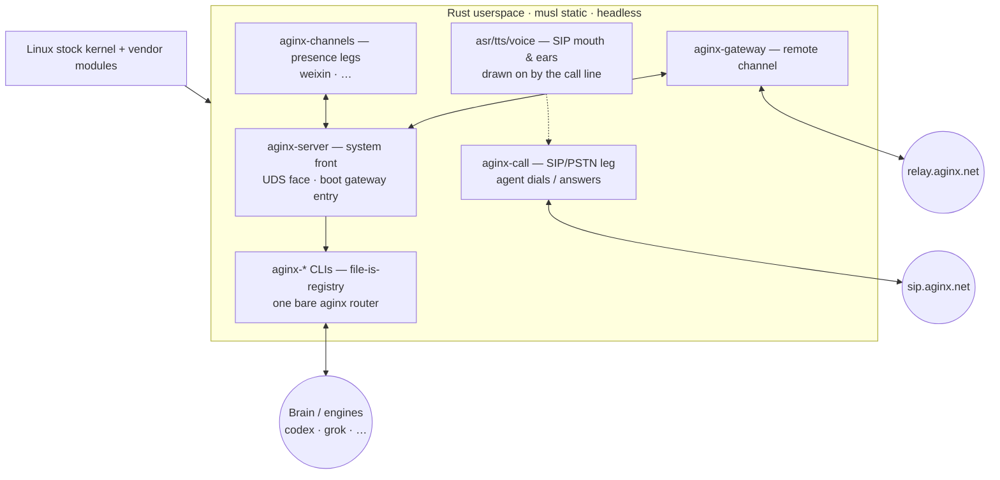

<div align="center">

# AginxOS

**A black-box ARM server OS for AI agents — written in Rust.**

Linux kernel for drivers · Rust userspace for the system · real metal, no emulator

[](https://www.rust-lang.org)
[](https://musl.libc.org)
[](#the-metal)
[](./LICENSE)

给 Agent 的黑匣子 ARM 服务器 —— 人只刷机、通电、插网，之后全是 agent。

</div>

---

This repository is the **platform heart** of AginxOS: it owns the device and
the bake chain. Positioning authority:
[`AGENTS.md`](./AGENTS.md) (2026-10-01) and [`docs/DESIGN.md`](./docs/DESIGN.md).
The first-generation repo
([`aginxos`](https://github.com/yinnho/aginxos)) is frozen as the asset
library; the fetch/HTML engine lives in
[`aginxbrowser`](https://github.com/yinnho/aginxbrowser); signed packages
mirror at [pkgs.aginx.net](https://pkgs.aginx.net).

## An OS whose primary user is an agent

AginxOS is a **black-box ARM server**. The machine has no human interface:
no screen, no local voice dialog, no camera. A human's entire relationship
with it is flash, power, and network; every operation after that is the
agent's — over ssh / relay / `agent://`.

External communication is a first-class *capability*, not a human feature:

- **SIP/PSTN is the agent's outbound telephony** (`aginx-call`, sip.aginx.net) —
  the agent dials, answers, speaks and listens on the line.
- **Channels are presence** — WeChat, relay, SIP, and more under
  `{AGINX_HOME}/channels/`; each channel is one directory + one opt-in package.
- **Everything external is a CLI.** Capabilities enter as `aginx-*` binaries;
  a single bare `aginx` router dispatches. No in-process plugin ABI to fight.
- **Engines are commodity labor** — codex / grok / other agent CLIs as
  replaceable opt-in packages; personhood and memory stay on the machine.

AginxOS is _not_ an app framework and _not_ a phone UI product. It is a
full machine bring-up: boot chain, A/B updates, a supervisor, a signed
package chain, and an agent-facing control plane. Phones on the bench are
ARM servers that happen to look like phones; server-class boards
(Panther X2, …) are first-class machines.

## Measured on the device, or it didn't happen

The project's law is **compile success ≠ bring-up success** — every claim
below carries a receipt from real hardware:

- Headless L0 image: kernel + init + supervisor + network + ssh + pkg;
  image `svc.d` ships exactly 2 units; everything else is opt-in
- Device acceptance suites green after flash (`scripts/accept/`)
- A/B slot updates through an ed25519-signed package chain — staged,
  atomic, self-recovering
- Remote channel: `aginx-gateway` registers to relay — the node is
  reachable from anywhere as if local
- SIP leg promoted as the agent's external telephony (M48 backlog rides
  that line)

Frozen / retired human-face lines (camera, panel term, local PTT dialog as
a product) stay in-tree as packages or assets with **zero new investment** —
see Positioning in `AGENTS.md`.

## The metal

**Experiment units:** Google Pixel 5 (`redfin`) and OnePlus 6 (`enchilada`) —
unlocked, no Android userspace, no emulator. **Server-class boards** are
first-class (first purchase: Panther X2, `docs/DEVICE-PANTHER-X2.md`).

```text
XBL (fused, signed) → AginxOS bootloader → Linux stock kernel + vendor modules → Rust userspace
```

- L0 base only in the image; engines, channels, gateway, SIP mouth/ears
  (asr/tts/voice as SIP-line internals), and tools ride packages
- Remote channel: `aginx-gateway` → `relay.aginx.net`
- busybox and a thin C / Python tool tier ride along as assets; the system
  itself — supervisor, server, packages, gateway, call — is Rust

## Machines are data (D14)

The platform (`crates/` + `rootfs/` + `scripts/`) carries zero machine
references: no panel size, no event-node path, no SoC name in any crate.
Every machine difference lives in `devices/<codename>/` — a TOML profile,
module list, bring-up init, boot packing line, and optional camera sources.
`DEVICE=<codename> ./scripts/build-rootfs.sh` bakes that machine.

**Adding a machine is a new directory plus a bring-up line — the platform
doesn't change.** Laws (enforced by a grep gate in `check.sh`): machine
strings in crates are unconstitutional; there is no default machine; device
dirs never import each other. OTA manifests carry a mandatory `device`
field. See [`devices/README.md`](devices/README.md).

## Architecture


```mermaid
flowchart TB
    K["Linux stock kernel + vendor modules"]
    subgraph U["Rust userspace · musl static · headless"]
        S["aginx-server — system front<br/>UDS face · boot gateway entry"]
        C["aginx-* CLIs — file-is-registry<br/>one bare aginx router"]
        G["aginx-gateway — remote channel"]
        CH["aginx-channels — presence legs<br/>weixin · …"]
        CALL["aginx-call — SIP/PSTN leg<br/>agent dials / answers"]
        V["asr/tts/voice — SIP mouth & ears<br/>drawn on by the call line"]
    end
    B(("Brain / engines<br/>codex · grok · …"))
    L(("relay.aginx.net"))
    SIP(("sip.aginx.net"))
    K --> U
    S --> C
    G <--> S
    G <--> L
    CH <--> S
    CALL <--> SIP
    V -.-> CALL
    C <--> B
```

## Crates (selected)

| Crate | Binary | Role |
|-------|--------|------|
| `crates/router` | `aginx` | the bare command — file-is-registry dispatch |
| `crates/server` | `aginx-server` | system front (UDS face + boot gateway entry) |
| `crates/call` | `aginx-call` | SIP leg — agent's outbound telephony (promoted) |
| `crates/voice` | `aginx-voice` | SIP-line mouth/ears machinery (human dialog line retired) |
| `crates/channels` | `aginx-channels` | channel system home — presence legs |
| `crates/pkg` | `aginx-pkg` | signed package manager |
| `crates/svc` | `aginx-svcd` / `aginx-svc` / `aginx-boot-ok` | supervisor + A/B marker |
| `crates/hwd` | — | device profile reader (D14 single legal source) |
| `crates/agio` | — | D1 output envelope |
| `crates/{types,memory,clone,dup,lifecycle}` | — | engine leftovers feeding personhood / install lines |

Frozen face packages (`aginx-term`, OCR/QR optics, …) remain installable
but are not part of the server product story.

## Building & discipline

- `./scripts/check.sh` — host gate before every commit
- `DEVICE=redfin ./scripts/build-rootfs.sh` — bake a machine's flashable
  image (`out/rootfs.img`; see `rootfs/README.md`)
- `devices/<codename>/boot/flash-*.sh` — flash day (dry-run default, `GO=1`)
- `./scripts/ota-manifest.sh` — signed update manifest with mandatory `device`
- `./scripts/accept/*.sh` — device acceptance suites

Milestone history and working rules: `AGENTS.md`. Machine-tree design:
[`docs/FS.md`](docs/FS.md). World model: [`docs/DESIGN.md`](docs/DESIGN.md).

## Ecosystem

| Repository | Role |
|------------|------|
| `aginxos-next` (this repo) | platform heart — device, bake chain, system front |
| [`aginxbrowser`](https://github.com/yinnho/aginxbrowser) | agent fetch / HTML engine (capability package) |
| `aginxbrain` | OpenAI-format brain API |
| [`aginx`](https://relay.aginx.net) | gateway daemon + `relay.aginx.net` |
| [duphub.com](https://duphub.com) | clone directory + file-level distribution |
| [`aginxos`](https://github.com/yinnho/aginxos) | first generation, frozen — asset library |
| [pkgs.aginx.net](https://pkgs.aginx.net) | signed package mirror for `aginx-pkg` |

## Status & license

Early and fast-moving: experiment phones + server-board bring-up, daily
work, no public releases yet.

MIT — except vendor firmware blobs, which are never committed (extracted
locally, gitignored).
