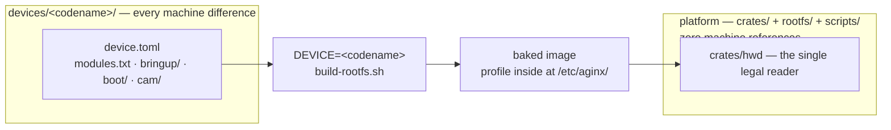

# AginxOS Architecture

This is the public architecture note. The working constitution, the
device serials, and the experiment log with its receipts are kept out of
the public repo; what follows is the declassified distillation. Nothing
here is aspiration — every mechanism described was first observed on
real hardware (the rule of the project: *compile success ≠ bring-up
success*).

## One machine, one server

AginxOS is built as a web server you can hold in your hand. The mapping:

| Web world | AginxOS |
|---|---|
| Linux box | Linux kernel + Rust userspace — the body: audio, panel, camera, radio as an I/O surface |
| The web server itself | **The mother** (`aginx`): the one resident scheduler. Listens, routes, supplies tools, manages worker lifecycles, keeps the books, enforces policy. No brain of its own — it calls one |
| Web sites | **Avatars**: many, first-class, independent (persona, tools, knowledge, session state), deployed as packages |
| The street address / front desk | **`me`** — the mother's own address. An unroutable request falls to the front desk, which asks where it should go |
| FastCGI | **fast-agi**: the execution protocol between the server and avatar workers |
| An HTTP request | A request: voice (push-to-talk → ASR text), CLI, or remote |
| The response page | An artifact, projected onto the panel; speech is its optional audio track (pull-mode) |
| cron / background workers | Autonomous work: self-growth, idle learning, scheduled jobs — headless, screen off |
| Third-party APIs | Upstream services (other agents, SaaS) — *tools*, not sites; they enter as CLIs |
| Server-to-server | The server reaching out to other AginxOS machines; a server twin runs the same Aginx on a server |

The "one" lives in the server (scheduling), the "many" live in the
avatars (the mother's organs), and the "self" of the whole system is the
mother. *Phone as agent*, precisely: the phone is a server + a body +
the mother's face.

## The constitution (D1–D14)

**The five primitives.** agent, cli, api, brain, memory — treated as OS
primitives, not applications. Everything below is these five arranged
into a machine.

- **D1 — one output contract.** Every command speaks the same output
  envelope (`agio`), so the mother can consume anything another command
  produces. (Its original three-layer invocation scheme was retired by
  D10; the contract itself stands.)
- **D2 — no MCP, no plugin ABI.** Externals never link in. Anything
  installed from outside — agent, SaaS, or tool — enters as a CLI.
- **D3 — tools are packages.** A tool ships as a signed four-piece
  package (four tars + manifest); installing it is registering it.
- **D4 — one server per machine.** The agent-loop lives in the platform
  server: the single resident scheduler. There is no second loop in the
  application layer.
- **D5 — avatars are folders; one runtime engine runs them.** An avatar
  is a folder under `workspaces/` (persona, tools, knowledge, session
  log — the persistent form); running it is an instance of the *same*
  runtime engine with that folder as its context (the running form).
  Cold = folder on disk, hot = engine instance; avatars differ by data,
  never by code. The four-piece package is the folder's distribution
  form.
- **D6 — display is request semantics.** The panel is a response
  projection, not a UI. A human request being served → project the
  response; background work running → screen dark. There is no chat
  interface: the transcript is a debug log, not a product surface.
- **D7 — two channels.** Product surface = voice (push-to-talk in,
  artifacts out, spoken on request). Development surface = CLI, text in,
  text out. Launchers and chat TUIs are retired.
- **D8 — the session log is the truth source.** An append-only event
  stream is the only source of model-visible context; projections
  (panel, history, memory consolidation) are all derived from it. The
  law: *model-visible = recorded*. Nothing reaches a model that is not
  in the log.
- **D9 — active vs passive input.** Human input (speech, keys) must have
  a routing answer; that answer is the **session cursor** — which
  conversation, which avatar — held by the server. Passive input (cron,
  workers) has its target bound at definition time. `send --to X` sets
  the cursor explicitly; no name given, the cursor persists.
- **D10 — addressing is front-desk registration.** The lifecycle:
  *enter* (name an avatar → registered, cursor moves into her
  conversation), *stay* (no name → the current conversation continues —
  continuity comes from the session log, she remembers), *switch* (name
  a new avatar directly), *check out* (a leave word, a dead session, or
  idle decay → cursor returns to the mother). A fresh boot starts at the
  front desk.
- **D11 — the mother is `aginx`.** Not an avatar — an organ cannot
  contain the whole. All avatars are her components; she is the platform
  itself. Her powers: **gateway** (everything in and out passes her),
  **omniscience by geometry** (all requests pass the server, all tools
  pass the router, all output passes the gateway — plus D8's ledger),
  **firewall** (platform policy; local word lists as the no-brain floor,
  the brain for fuzzy calls), **two repair modes** (tell-the-avatar: pack
  a fault into a prompt and hand her a diagnosis skill; or
  fix-for-the-avatar: restart, reconnect, restore), and **she calls the
  brain** for platform work. Spawning avatars and managing their
  evolution (install tools, edit personas, feed knowledge — or delegate
  evolution to the avatar itself) are platform functions, not any single
  avatar's capability. `me` is her front-door name.
- **D12 — externals are CLI-only.** One shape, three flavors: tool CLIs
  (compute, exit), service CLIs (front a remote SaaS; credentials go to
  the secret sidecar), agent CLIs (bring their own loop, driven through
  an adapter). The **registry is the filesystem itself** — a command
  file present in the scan directory *is* the registration. Outbound
  hand = CLI; inbound ear = webhook → one request, routed to the avatar
  owning that integration. A package may keep a resident engine behind
  its CLI face (expensive things stay resident; the door is still a
  CLI) — the router spawns the face, the ledger still records.
- **D13 — the aginx surname.** One bare command, `aginx` — the router,
  the mother's face. One prefix, `aginx-`. Grammar
  `aginx-<domain>-<object>-<verb>`, verb last; the human tree
  (`aginx voice say …`) and the flat file face (`aginx-voice-say`) are
  one grammar written twice. The naming law governs the command
  universe, not resident engine names.
- **D14 — machines are data, not code.** The platform carries zero
  machine references; every machine difference lives in a per-device
  directory. See the next section.

## Machines are data — the device layer (D14)

Adding a machine is a new directory plus a bring-up line; the platform
does not change. All device differences live in `devices/<codename>/`:

| Piece | What it is |
|---|---|
| `device.toml` | The machine profile: panel, input nodes, audio, quirks, CPU affinity, camera, paths. Baked into the image at `/etc/aginx/device.toml`; `crates/hwd` is the single legal reader |
| `modules.txt` | The ordered ramdisk module list — the order *is* data (a probed dependency sequence) |
| `bringup/` | Hardware bring-up init scripts, installed to `/etc/init.d/` by name |
| `boot/` | This machine's boot-image packing and flash line (vendor-boot style, dtbo style, …) |
| `cam/` | Sensor sources: timing, registers, calibration are per-machine; the encoders are platform code |

Three laws, enforced: (1) a machine string appearing in a platform
crate is unconstitutional — `hwd` reading the profile is the only legal
source, and a grep gate in the host check fails the build on any hit
(exempt lines carry a reviewed inline marker); (2) the platform may hold
*slots* for machines (quirk switches, affinity tables, argument strings)
but never a *default machine* — a missing profile fails fast at boot,
because a fallback is a hidden machine assumption leaking back in;
(3) device directories never import each other — shared assets are
promoted to `scripts/` or `rootfs/`, no `devices/common/` middle layer.

The add-a-machine checklist lives in [`devices/README.md`](../devices/README.md).

## Runtime model

- **fast-agi v0** — stdio JSONL frames between server and runtime
  engine: `request / tool_call / tool_result / artifact / steer / done`.
  A worker is spawned on demand or kept resident; `steer` inserts into a
  running turn at step boundaries.
- **The log is the truth.** Every model-visible event is an append to
  the session's event stream first; everything else — panel, history,
  memory — is a projection. Crash recovery replays the log; the result
  page survives a restart.
- **The cursor is a session cursor.** Not "which window" but "which
  conversation": the server holds the current session; naming an avatar
  moves the cursor; the front desk is the fallback.
- **Autonomous work** — scheduled jobs and self-growth run headless as
  workers with targets bound at definition time (D9's passive half).

## Build & OTA

- **Bake:** `DEVICE=<codename> ./scripts/build-rootfs.sh` — the generic
  recipe plus that machine's profile, modules, bring-up scripts, and
  camera build produce the flashable image; the version stamp carries
  the codename.
- **Flash:** each machine owns its one-command flash script
  (`devices/<codename>/boot/flash-<codename>.sh`) which pins every
  fastboot call to the serial *from that machine's profile* and refuses
  to run against anything else on the bench. Dry-run by default;
  payload partition first, the switching image last — the commit point
  is the final write.
- **OTA:** update manifests are ed25519-signed and carry a mandatory
  `device` field. Verification happens before the manifest is even
  parsed; a manifest naming another machine is refused before a single
  byte is staged. The A/B slot update writes partition bytes first and
  flips the slot attribute last; rootfs images are staged on a swap area
  whose geometry is frozen per machine and registered in the device
  profile. An unbootable new slot rolls back automatically after its
  retry budget drains.

## Security boundaries (fail-closed list)

- An update manifest without a valid signature dies before parse; a
  pre-D14 manifest without a `device` field fails to parse outright.
- A manifest whose `device` ≠ this machine's profile is refused.
- A missing or malformed device profile is a hard boot error — there is
  no default machine.
- State carried across a rootfs update never overwrites image-owned
  config (units, policy, gateway shape, groups, the device profile
  itself) — an old state tar must not roll the machine's identity back.
- Credentials (brain API keys, Wi-Fi psk, relay secrets) live only in
  runtime config and the secret sidecar; they are never committed,
  never echoed, never logged.
- Vendor firmware blobs are extracted locally and never committed.

## Hardware surface taxonomy

How a machine fact chooses its seat:

| Class | Lives as | Examples |
|---|---|---|
| **A — data** | Fields in `device.toml` | panel size, event-node paths, PCM devices, quirk switches, core affinity, capture law |
| **B — procedure** | Scripts in the device dir | module load order, bring-up init, boot-image packing, the flash line |
| **C — source** | C/Rust sources in the device dir | sensor timing and register sequences, calibration constants |

Rule of thumb: if it is a *number another crate reads*, it is A. If it
is a *sequence only the bring-up runs*, it is B. If it *compiles per
sensor*, it is C. Shared algorithms (JPEG encode, tone curves) are
platform code and stay out of the device dir.
